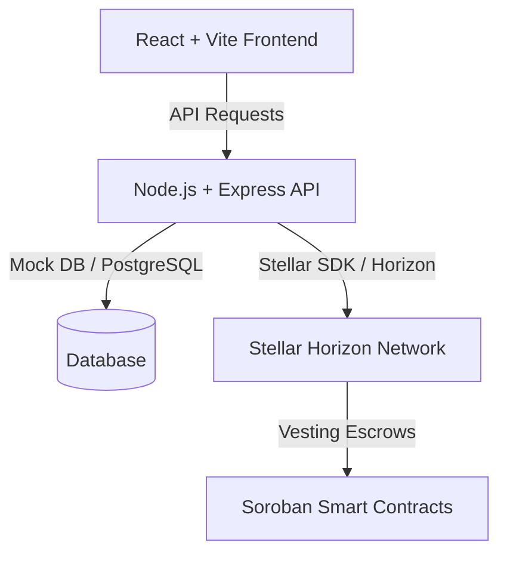

# ChronosPay - Decentralized Real-Time Payment Streams

ChronosPay is a continuous real-time linear vesting and payment streaming protocol built on the Stellar Soroban smart contract network. It allows senders to lock up funds in escrow and distribute them continuously over time to a recipient, who can withdraw their vested funds at any second.


## 🌟 Core Features

- **Continuous Linear Vesting**: Escrows stream funds per second based on the ledger timestamp.
- **Recipient Pull-Based Withdrawals**: Recipients claim any vested funds directly from the contract.
- **Time-Split Cancellations**: Senders can cancel active streams at any point. Vested portion goes to the recipient, unvested is instantly refunded.
- **Stellar Horizon / Friendbot Support**: Simulated locally or integrated directly with testnet Horizon Horizon clients.
- **Premium User Interface**: Mobile-first glassmorphic UI shell built in React with live count-up tickers.

---

## 🛠️ Architecture & Tech Stack



### 📦 Project Structure

- [contracts/](file:///workspaces/STELLARR/contracts/) - Soroban smart contracts (`ChronosPayEscrow`) written in Rust.
- [backend/](file:///workspaces/STELLARR/backend/) - Node.js Express API and backend tests.
- [frontend/](file:///workspaces/STELLARR/frontend/) - Vite + React mobile-first simulated interface.
- [database/](file:///workspaces/STELLARR/database/) - Schema definitions for PostgreSQL databases.

---

## 🚀 Running the Project

### 1. Set Up Environment Variables

Copy the example template to create your `.env` file:
```bash
cp .env.example .env
```

### 2. Run the Backend API

Install dependencies and start the backend:
```bash
cd backend
npm install
npm run dev
```
*Note: The backend will automatically fall back to an in-memory mock database if `DATABASE_URL` is omitted.*

### 3. Run the Frontend Interface

Install dependencies and start the frontend dev server:
```bash
cd frontend
npm install
npm run dev
```

Open [http://localhost:3000](http://localhost:3000) in your browser to view the client.

### 🧪 Run Tests

To run the API integration test suite:
```bash
cd backend
npm test
```
